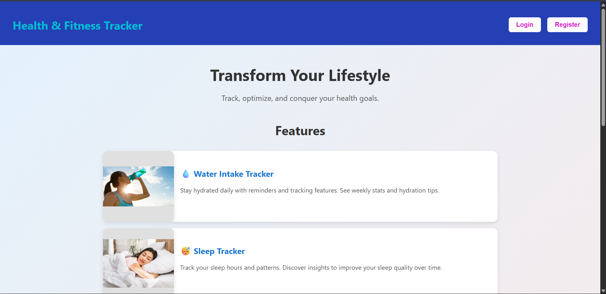
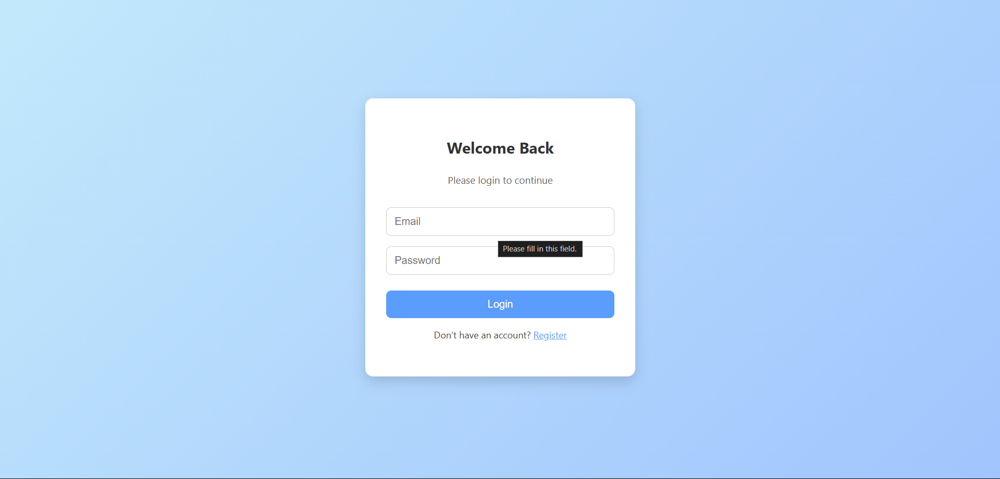
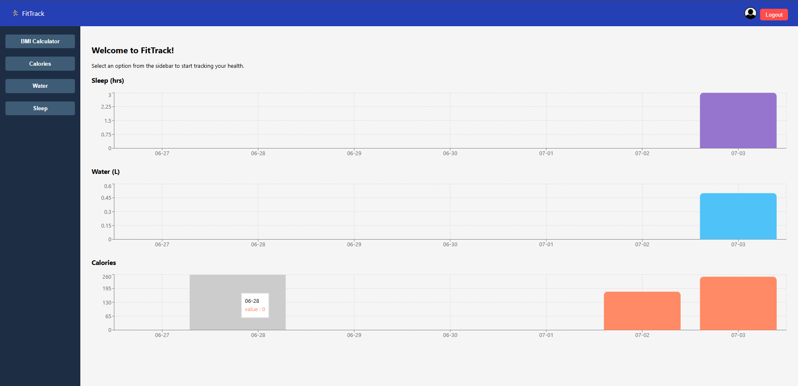
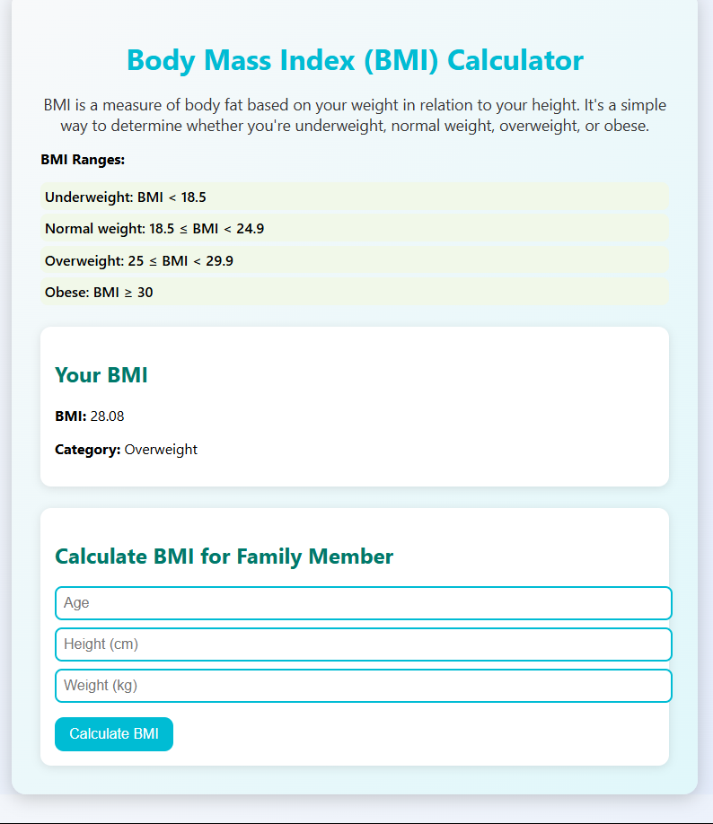
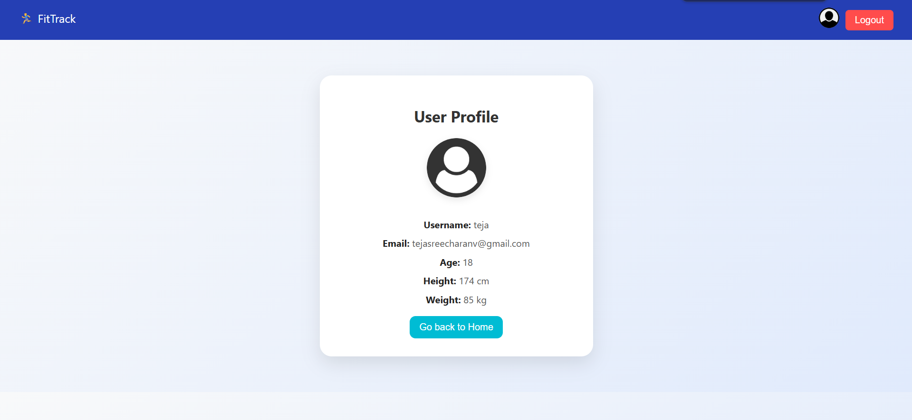
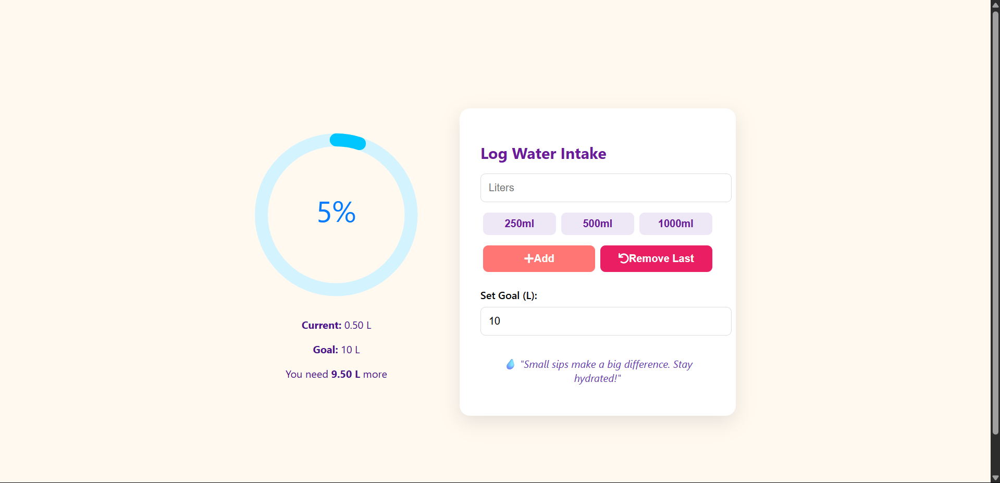
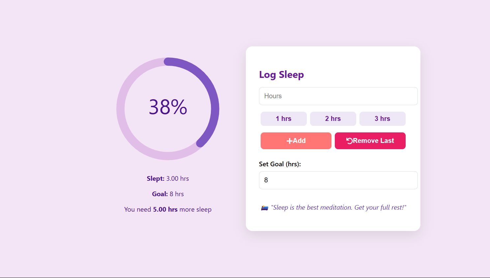
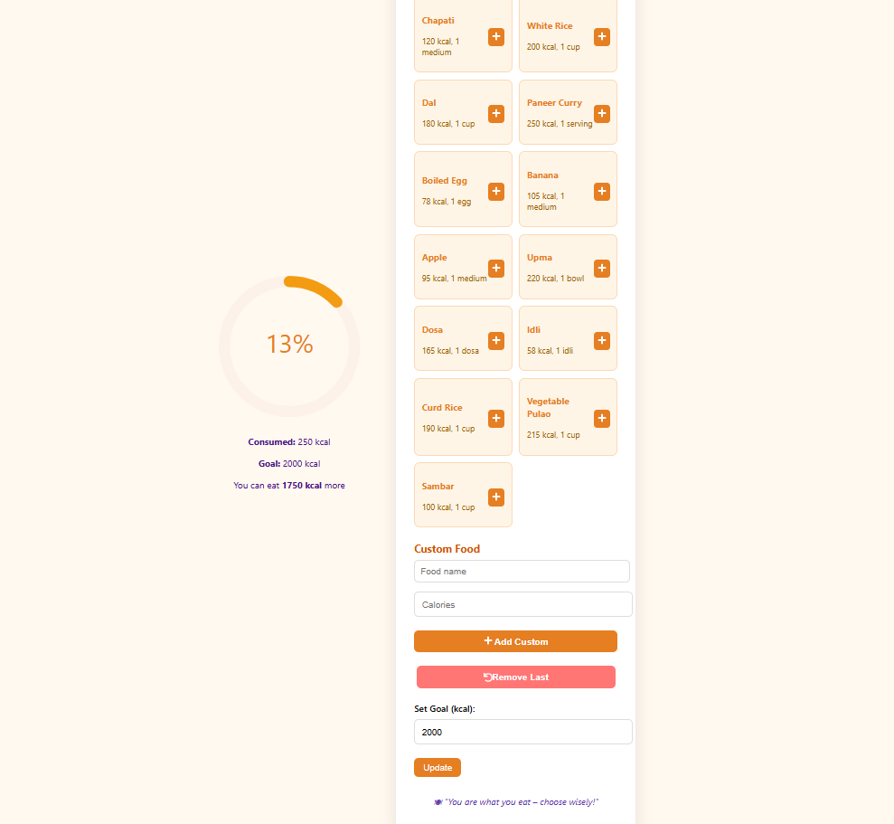

# 🏋️‍♂️ Fitness Tracker

A full-stack Health and Fitness Tracker web application to help users monitor and manage their daily fitness goals — including calorie intake, water consumption, sleep tracking, and more.

---

## 🛠 Tech Stack

- **Frontend:** React.js (Port: `3000`)
- **Backend:** Node.js + Express (Port: `5000`)
- **Database:** MySQL (Port: `3306`)

---

## 🔗 System Architecture

```

Database (MySQL) ---> Backend (Express) ---> Frontend (React)
3306                  5000                  3000

````

All frontend requests go through the backend, which fetches or updates data from the MySQL database.

---

## 📦 Features

- ✅ User authentication using JWT
- 🍽 Calorie counter and diet logger
- 💧 Water intake tracker
- 💤 Sleep monitor
- 🏃 Exercise log
- 📊 Reports & progress over time
- 📅 Daily reset logic at midnight
- 🎯 Set and update personal fitness goals
- 🌐 Persistent data storage using MySQL

---

## 🚀 Getting Started

### 1. Clone the Repository

```bash
git clone https://github.com/teja0308/Fitness-Tracker.git
cd Fitness-Tracker
````
---

### 2. Install Dependencies

```bash
cd backend
npm i

cd ../frontend
npm i
```

### 3. Setting up the Database

Make sure MySQL is running on your system.
Import the schema from `backend/sql/` into your local MySQL server.
Update database credentials in: `backend/config/db.js`

### 4. Run the Project

#### Start Backend

```bash
cd backend
nodemon index.js
```

#### Start Frontend

```bash
cd ../frontend
npm start
```

---

## 🕒 Auto Reset at Midnight

A background timer automatically resets daily logs (like calories, water, etc.) at midnight using a `setTimeout` and `setInterval` logic.

---

## 📸 Screenshots









## 🙌 Contributing

Feel free to fork the repository and submit pull requests to improve features or fix bugs.

---


